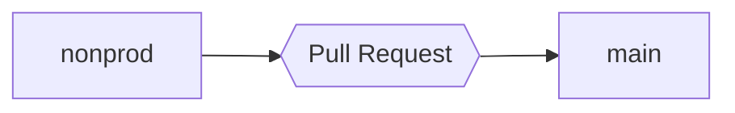

# Omniparser_Schemas

Placeholder for Omniparser Schemas used by universal-etl-parser API.

## Branch flow for schema changes

Helpful links:

* [Link to nonprod branch](https://github.com/mednax-it/Omniparser_Schemas/tree/nonprod)
* [Open a pull request](https://github.com/mednax-it/Omniparser_Schemas/compare/main...nonprod)
* [Link to main branch](https://github.com/mednax-it/Omniparser_Schemas)

## HL7 Omniparser Schema

Omniparser Schema used to convert HL7 messages to a JSON format consistent with a FHIR v4.3.0 bundle

### Resource Identifier Design

**Resource UUID Definition**

Each resource utilizes a UUID to uniquely identify and reference the resource in a Transaction Bundle. The following format is used to provide a additional mechanism to quickly identify the resource type:

__Bundle Resource fullUrl UUID Format__

    {a}-{b}-{c}-{d}-{e}

Where:
a - "61ebe121" (random and persisted)
b - 4 digit 1-index custom resource id
c - 4 digit 1-index custom resource type id
d - 4 digit 1-index occurrence count
e - "983a382abcd7" (random and persisted)

__Custom Resource IDs__
1. Patient					aa01
    1. inpatient			0001
2. Organization			    aa02
	1. facility			    0001
	2. payor				0002
    3. department           0003
3. Encounter				aa03
	1. encounter			0001
4. Account					aa04
	1. account				0001
5. RelatedPerson			aa05
	1. Guarantor			0001
	2. Subscriber			0002
	3. Next of Kin			0003
6. Coverage				    aa06
	1. insurance			0001
7. Practitioner			    aa07
	1. admitting			0001
	2. referring			0002
8. Claim                    aa08
    1. Claim                0001

Instance Counter		0001, 0002, 0003

Examples:
Resource UUID for Patient

    61ebe121-aa01-0001-0001-983a382abcd7

Resource UUID for Referring physician practitioner resource

    61ebe121-aa07-0002-0001-983a382abcd7

Resource UUID for secondary insurance Coverage resource

    61ebe121-aa06-0001-0002-983a382abcd7

Resource UUID for subscriber resource of the primary insurance

    61ebe121-aa05-0002-0001-983a382abcd7

Resource UUID for secondary insurance Coverage resource

    61ebe121-aa06-0001-0002-983a382abcd7

### Resource Identifier Design

**Patient Identifier**

*Patient* resource will be used to retain patient information. The identifier will be concatenation of the medical record number (MRN) of the patient, and facility ID at which the service was rendered.

    {mrn}-{facility_id}

This identifier will be referred to as "MRN Facility" (`mrn_facility`).

**Account Identifier**

*Account* resource will be used to retain the patient account information. The identifier will be `mrn_facility`.

**Guarantor Identifier**

*RelatedPerson* resource will be used to retain the guarantor information. The identifier will be concatenation of `mrn_facility` and the guarantor number (GT1.2)

    {mrn}-{facility_id}-{guarantor_number}

If guarantor number does not exist, identifier will default to concatenation of `mrn_facility`, the guarantor segment code (GT1) and the guarantor segment Set ID (e.g. 1, 2)

    {mrn}-{facility_id}-GT1-{guarantor set id}.
**Subscriber Identifier**

*RelatedPerson* resource will be used to retain the subscriber information. The identifier will be concatenation of `mrn_facility` and the insurance plan id (IN1.2)

    {mrn}-{facility_id}-{plan_id}.

If plan number does not exist, identifier will default to concatenation of `mrn_facility`, the Insurance segment code (IN1) and the Insurance segment Set ID (e.g. 1, 2)

    {mrn}-{facility_id}-IN1-{insurance set id}

**Payor Identifier**

*Organization* resource will be used to retain the Insurance Company information __if the patient has insurance.__ the identifier will be concatenation of `mrn_facility` and the insurance plan id (IN1.2)

    {mrn}-{facility_id}-{plan_id}.

If plan number does not exist, identifier will default to concatenation of `mrn_facility`, the Insurance segment code (IN1) and the Insurance segment Set ID (e.g. 1, 2)

    {mrn}-{facility_id}-IN1-{insurance set id}
**Attending Physician Identifier**

*Pratictioner* resource will be used to retain the Attending Physician information. the identifier will be concatenation of `mrn_facility` and the attending physician id (PV1.7.1)

    {mrn}-{facility_id}-{attending_physician_id}

If attending physician id does not exist, identifier will default to concatenation of `mrn_facility`, the patient visit segment code "PV1" and the FHIR ParticipationType Code System value "ATND"

    {mrn}-{facility_id}-PV1-ATND

**Referring Physician Identifier**

*Pratictioner* resource will be used to retain the Referring Physician information. the identifier will be concatenation of `mrn_facility` and the referring physician id (PV1.8.1)

    {mrn}-{facility_id}-{referring_physician_id}

If referring physician id does not exist, identifier will default to concatenation of `mrn_facility`, the patient visit segment code "PV1" and the FHIR ParticipationType Code System value "REF"

    {mrn}-{facility_id}-PV1-REF

