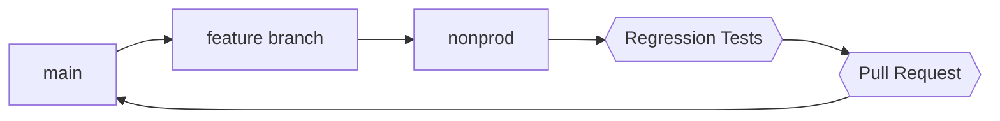

# Omniparser_Schemas

JSON schemas used by the [universal-etl-parser](https://universal-etl-parser.mdnxdev.com/) API to transform HL7v2 messages into FHIR R4 transaction bundles.

Regression tested by [omniparser-schema-template-tests](https://github.com/mednax-it/omniparser-schema-template-tests).

## Schema Files

| File | Environment | `Content-Schema` header value |
|---|---|---|
| `hl7v2_default.json` | Production | `hl7v2_default` |
| `hl7v2_default_test.json` | Nonprod / spike validation | `hl7v2_default_test` |
| `edi_271.json` | All | `edi_271` |
| `edi_271_enhanced.json` | All | `edi_271_enhanced` |

> **Important:** The regression test suite targets `hl7v2_default` (production schema). All schema changes must be applied to `hl7v2_default.json` — not only `hl7v2_default_test.json` — to be covered by regression tests.

## Development Workflow

### Feature branch flow


```mermaid
graph LR;
    main[main] --> fb[feature branch]
    fb --> nonprod[nonprod]
    nonprod --> test{{Regression Tests}}
    test --> pr{{Pull Request}}
    pr --> main
```

1. **Branch** from `main` — never from `nonprod` (`nonprod` may lag behind `main` and contains unmerged work)
2. **Develop** schema changes on the feature branch
3. **Merge** the feature branch into `nonprod` (no PR review required) — deploys to the nonprod parser
4. **Run** regression tests against nonprod (see [Testing](#testing))
5. **Iterate** on the feature branch if tests fail, re-merge to `nonprod`
6. **Open a PR** from the feature branch → `main` once tests pass

### Branch links

* [nonprod branch](https://github.com/mednax-it/Omniparser_Schemas/tree/nonprod)
* [Open a pull request](https://github.com/mednax-it/Omniparser_Schemas/compare/main...nonprod)
* [main branch](https://github.com/mednax-it/Omniparser_Schemas)

## Testing

Regression tests live in [omniparser-schema-template-tests](https://github.com/mednax-it/omniparser-schema-template-tests). Tests POST raw HL7 messages to the nonprod parser and assert against the returned FHIR Bundle.

### How it connects

```
omniparser-schema-template-tests
  │  POST HL7 message body
  │  Header: Content-Schema: hl7v2_default
  ▼
universal-etl-parser (https://universal-etl-parser.mdnxdev.com/)
  │  resolves schema by name
  ▼
Omniparser_Schemas/hl7v2_default.json  ← must contain your changes
```

### Run regression tests

```bash
# Prerequisites: poetry (https://python-poetry.org) and direnv (https://direnv.net)
export PARSER_URL="https://universal-etl-parser.mdnxdev.com/"

cd omniparser-schema-template-tests
poetry install
poetry run test
```

### Adding test coverage for new schema features

Every schema change that affects FHIR output needs corresponding coverage in `omniparser-schema-template-tests`:

| Step | Location | Action |
|---|---|---|
| 1 | `tests/regression/regression_test_data/<Resource>/` | Add HL7 test data file (next sequential number) |
| 2 | `tests/regression/reg_globals/<resource>_reg_global.py` | Add expected value constants |
| 3 | `tests/regression/<resource>_resource.py` | Add assertions in a new `if testfile == "<n>":` block |
| 4 | `tests/regression/main.py` | Register the new test case |

### Known parser schema constraints

The Omniparser `omni.2.1` schema validator enforces strict property rules. The following are **not supported** and will cause a `400` validation error:

- `repeat_index` — accessing specific HL7 repetitions (fields separated by `~`) is not natively supported
- `repetition_delimiter` — cannot be declared in `file_declaration`

To handle HL7 repeated fields (e.g. PID-9 patient aliases), capture the raw field value without `component_index` and parse repetitions using a `custom_func` JavaScript transform. See `transform_alias_1_last_name` in `hl7v2_default.json` for a working example.

## HL7 Omniparser Schema

Omniparser Schema used to convert HL7 messages to a JSON format consistent with a FHIR v4.3.0 bundle

### Resource Identifier Design

**Resource UUID Definition**

Each resource utilizes a UUID to uniquely identify and reference the resource in a Transaction Bundle. The following format is used to provide a additional mechanism to quickly identify the resource type:

__Bundle Resource fullUrl UUID Format__

    {a}-{b}-{c}-{d}-{e}

Where:
a - "61ebe121" (random and persisted)
b - 4 digit 1-index custom resource id
c - 4 digit 1-index custom resource type id
d - 4 digit 1-index occurrence count
e - "983a382abcd7" (random and persisted)

__Custom Resource IDs__
1. Patient					aa01
    1. inpatient			0001
2. Organization			    aa02
	1. facility			    0001
	2. payor				0002
    3. department           0003
3. Encounter				aa03
	1. encounter			0001
4. Account					aa04
	1. account				0001
5. RelatedPerson			aa05
	1. Guarantor			0001
	2. Subscriber			0002
	3. Next of Kin			0003
6. Coverage				    aa06
	1. insurance			0001
7. Practitioner			    aa07
	1. admitting			0001
	2. referring			0002
    3. admitting            0003
8. Claim                    aa08
    1. Claim                0001

Instance Counter		0001, 0002, 0003

Examples:
Resource UUID for Patient

    61ebe121-aa01-0001-0001-983a382abcd7

Resource UUID for Referring physician practitioner resource

    61ebe121-aa07-0002-0001-983a382abcd7

Resource UUID for secondary insurance Coverage resource

    61ebe121-aa06-0001-0002-983a382abcd7

Resource UUID for subscriber resource of the primary insurance

    61ebe121-aa05-0002-0001-983a382abcd7

Resource UUID for secondary insurance Coverage resource

    61ebe121-aa06-0001-0002-983a382abcd7


### Resource Identifier Design

**Patient Identifier**

*Patient* resource will be used to retain patient information. The identifier will be concatenation of the medical record number (MRN) of the patient, and facility ID at which the service was rendered.

    {mrn}-{facility_id}

This identifier will be referred to as "MRN Facility" (`mrn_facility`).

**Account Identifier**

*Account* resource will be used to retain the patient account information. The identifier will be `mrn_facility`.

**Guarantor Identifier**

*RelatedPerson* resource will be used to retain the guarantor information. The identifier will be concatenation of `mrn_facility` and the guarantor number (GT1.2)

    {mrn}-{facility_id}-{guarantor_number}

If guarantor number does not exist, identifier will default to concatenation of `mrn_facility`, the guarantor segment code (GT1) and the guarantor segment Set ID (e.g. 1, 2)

    {mrn}-{facility_id}-GT1-{guarantor set id}.
**Subscriber Identifier**

*RelatedPerson* resource will be used to retain the subscriber information. The identifier will be concatenation of `mrn_facility` and the insurance plan id (IN1.2)

    {mrn}-{facility_id}-{plan_id}.

If plan number does not exist, identifier will default to concatenation of `mrn_facility`, the Insurance segment code (IN1) and the Insurance segment Set ID (e.g. 1, 2)

    {mrn}-{facility_id}-IN1-{insurance set id}

**Payor Identifier**

*Organization* resource will be used to retain the Insurance Company information __if the patient has insurance.__ the identifier will be concatenation of `mrn_facility` and the insurance plan id (IN1.2)

    {mrn}-{facility_id}-{plan_id}.

If plan number does not exist, identifier will default to concatenation of `mrn_facility`, the Insurance segment code (IN1) and the Insurance segment Set ID (e.g. 1, 2)

    {mrn}-{facility_id}-IN1-{insurance set id}
**Attending Physician Identifier**

*Pratictioner* resource will be used to retain the Attending Physician information. the identifier will be concatenation of `mrn_facility` and the attending physician id (PV1.7.1)

    {mrn}-{facility_id}-{attending_physician_id}

If attending physician id does not exist, identifier will default to concatenation of `mrn_facility`, the patient visit segment code "PV1" and the FHIR ParticipationType Code System value "ATND"

    {mrn}-{facility_id}-PV1-ATND

**Referring Physician Identifier**

*Pratictioner* resource will be used to retain the Referring Physician information. the identifier will be concatenation of `mrn_facility` and the referring physician id (PV1.8.1)

    {mrn}-{facility_id}-{referring_physician_id}

If referring physician id does not exist, identifier will default to concatenation of `mrn_facility`, the patient visit segment code "PV1" and the FHIR ParticipationType Code System value "REF"

    {mrn}-{facility_id}-PV1-REF

**Admitting Physician Identifier**

*Pratictioner* resource will be used to retain the Admitting Physician information. the identifier will be concatenation of `mrn_facility` and the referring physician id (PV1.17.1)

    {mrn}-{facility_id}-{admitting_physician_id}

If admitting physician id does not exist, identifier will default to concatenation of `mrn_facility`, the patient visit segment code "PV1" and the FHIR ParticipationType Code System value "ADM"

    {mrn}-{facility_id}-PV1-ADM


